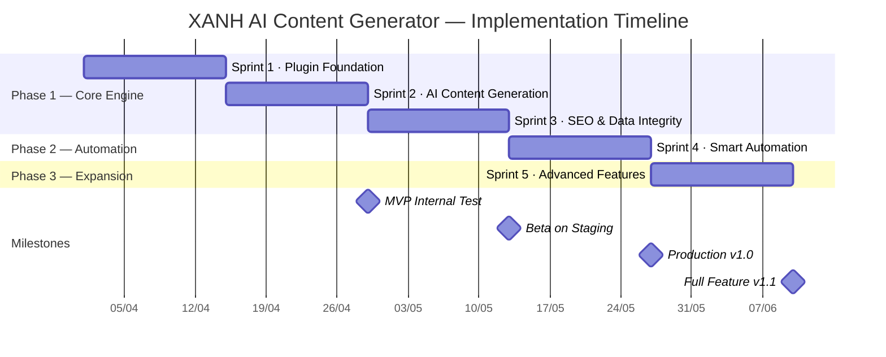
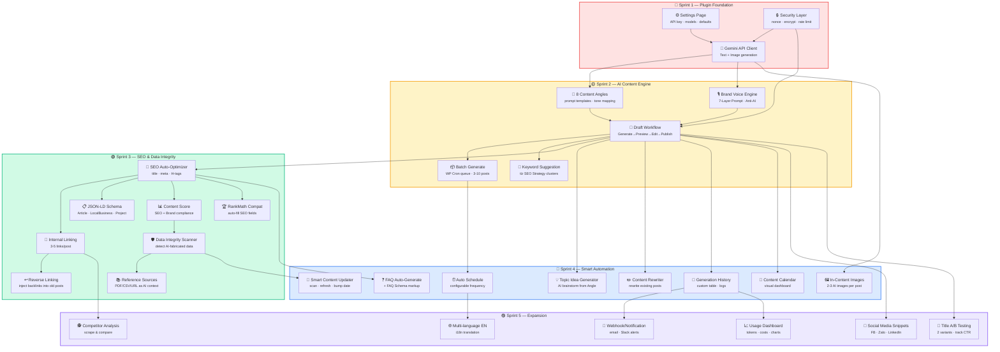

# 🗺️ ROADMAP — XANH AI Content Generator Plugin

> **Version:** 1.1.0 | **Tổng thời gian:** ~14 tuần (3.5 tháng)
> **Target:** Production-ready trên xanhdesignbuild.com
> **Tech Stack:** PHP 7.4+ · WordPress 6.0+ · Google Gemini API · WP Cron

---

## Lộ Trình Tổng Quan



---

## Feature Dependency Map



---

## Sprint 1 — Plugin Foundation (Tuần 1-2)

> **Mục tiêu:** Plugin hoạt động, kết nối Gemini API, Settings hoàn chỉnh

| # | Feature | Mô tả chi tiết | Output file |
|---|---|---|---|
| 8 | **Settings Page** | Trang cấu hình: API key (AES-256 encrypted), model selection, content defaults, rate limit config | `class-xanh-ai-settings.php` |
| 9 | **Security Layer** | Nonce verification, `current_user_can()`, input sanitize, output escape, rate limiting (10 req/min) | `class-xanh-ai-security.php` |
| — | **Gemini API Client** | Wrapper gọi Gemini 2.5 Flash (text) + Imagen 3.1 (image), error handling, retry logic, token counting | `class-xanh-ai-api.php` |
| — | **Plugin Bootstrap** | Singleton pattern, PSR-4 autoloader, activation/deactivation hooks, dependency check | `xanh-ai-content.php`, `class-xanh-ai-loader.php` |

**Deliverables:**
- [ ] Plugin activate/deactivate không lỗi
- [ ] Settings page lưu/đọc API key (encrypted trong `wp_options`)
- [ ] Gọi Gemini API trả về text thành công
- [ ] Gọi Imagen API trả về image → upload vào Media Library
- [ ] Rate limit chặn >10 requests/phút

---

## Sprint 2 — AI Content Engine (Tuần 3-4)

> **Mục tiêu:** Tạo bài viết đầu tiên bằng AI, đúng Brand Voice, hỗ trợ batch

| # | Feature | Mô tả chi tiết | Output file |
|---|---|---|---|
| 3 | **9 Content Angles** | Mỗi Angle có: objective, category, tone, CTA, internal links, image style. Angle quyết định toàn bộ prompt. Thêm Angle 9: Giải Đáp Thắc Mắc (Q&A) | `class-xanh-ai-angles.php` |
| 10 | **Brand Voice Engine** | 7-Layer System Prompt: Persona → Voice DNA → Anti-AI Patterns → E-E-A-T → Content Texture → SEO → Output Guard | `class-xanh-ai-prompts.php` |
| 6 | **Draft Workflow** | Flow: Chọn Angle → Nhập keyword → AI Generate → Preview draft → Human Edit → Save as draft/publish | `class-xanh-ai-generator.php` |
| 11 | **Batch Generate** | Queue 3-10 posts via WP Cron, progress tracking, retry on fail, email notify on complete | `class-xanh-ai-batch.php` |
| 14 | **Keyword Suggestion + Management** | Auto-suggest keywords từ 5 clusters. CRUD qua Settings UI + CSV/TXT upload (merge-dedup). Lưu `wp_options` | integrated |
| — | **Admin Generator Page** | AJAX form UI: angle selector, keyword input, preview panel, publish button | `admin/generator.php` |

**Deliverables:**
- [x] Chọn Angle → nhập keyword → AI tạo bài draft hoàn chỉnh
- [x] Bài viết đúng "Warm Luxury" tone, không có từ cấm
- [x] AI detection score < 20% (GPTZero)
- [ ] Batch 5 bài hoàn thành trong < 10 phút
- [x] Preview hiển thị đầy đủ trước publish

> [!IMPORTANT]
> 🏁 **Milestone: MVP Internal Test** — Team nội bộ test tạo 20+ bài, đánh giá chất lượng Brand Voice.

---

## Sprint 3 — SEO & Data Integrity (Tuần 5-6)

> **Mục tiêu:** Bài viết chuẩn SEO on-page, có schema, không data bịa

| # | Feature | Mô tả chi tiết | Output file |
|---|---|---|---|
| 4 | **SEO Auto-Optimizer** | Auto-generate: title (55-60 chars), meta description (150-160), H2/H3 structure, focus keyword density 1-2% | `class-xanh-ai-seo.php` |
| 5 | **Internal Linking Engine** | Tự chèn 3-5 internal links vào bài, dựa trên category + keyword matching với existing posts | integrated |
| 19 | **Reverse Internal Linking** | Khi publish bài mới → scan bài cũ cùng topic → inject backlink vào bài cũ (max 1 link/bài cũ) | `class-xanh-ai-backlinks.php` |
| 20 | **JSON-LD Schema Generator** | Auto-generate schema theo Angle: `Article` (mặc định), `LocalBusiness` (Local SEO), `Project` (Case Study), `HowTo` (DIY) | `class-xanh-ai-schema.php` |
| 15 | **Content Score** | Chấm điểm 0-100: keyword density, meta length, H-tag structure, internal links, brand compliance, readability | integrated |
| 18 | **Data Integrity Scanner** | So sánh số liệu trong bài với Verified Data Registry, flag số bịa trước khi publish | `class-xanh-ai-data-integrity.php` |
| 16-17 | **Reference Sources + Library** | Upload PDF/CSV/URL làm context cho AI. Source Library quản lý expiry, auto-extract data points | `class-xanh-ai-sources.php` |
| 7 | **RankMath Compatibility** | Auto-fill RankMath SEO fields: focus keyword, title, description, schema type | integrated |

**Deliverables:**
- [ ] Title/meta auto-generated đúng character limits
- [ ] 3-5 internal links chèn tự động chính xác
- [ ] Reverse linking inject vào 3-5 bài cũ liên quan
- [ ] JSON-LD valid 100% qua [Google Rich Results Test](https://search.google.com/test/rich-results)
- [ ] Content Score ≥ 80/100 trung bình
- [ ] Data Integrity flag được ≥ 90% số liệu bịa

> [!IMPORTANT]
> 🏁 **Milestone: Beta on Staging** — Deploy staging, tạo 50 bài test full SEO flow.

---

## Sprint 4 — Smart Automation (Tuần 7-8)

> **Mục tiêu:** Tự động hóa content pipeline, quản lý lịch sử, refresh content cũ

| # | Feature | Mô tả chi tiết | Output file |
|---|---|---|---|
| 19* | **Auto Schedule** | WP Cron publish tự động theo schedule configurable (daily/weekly), spread theo time slots tối ưu | `class-xanh-ai-scheduler.php` |
| 21 | **Topic Idea Generator** | AI brainstorm 10-20 topic ideas từ Angle + keyword cluster, xếp theo search volume + competition | integrated |
| 22 | **Content Rewriter** | Rewrite bài existing: giữ SEO structure, refresh content, đổi tone/Angle | `class-xanh-ai-rewriter.php` |
| 25 | **Smart Content Updater** | Cron quarterly scan bài >6 tháng → detect outdated data (năm, giá, số liệu) → AI refresh → bump publish date | `class-xanh-ai-updater.php` |
| 23 | **FAQ Auto-Generate** | Tự tạo 3-5 FAQ từ content + generate FAQPage Schema markup | integrated |
| 24 | **Generation History** | Custom DB table: log mọi generation (timestamp, tokens, cost, status, prompt hash) | `class-xanh-ai-history.php` |
| 12 | **Content Calendar** | Dashboard visual: lịch publish, drag-drop reschedule, status color coding | `admin/calendar.php` |
| 20* | **In-Content Images** | Tự chèn 2-3 AI-generated images vào body bài, match với section context | integrated |

**Deliverables:**
- [ ] Auto-schedule chạy ổn định 7+ ngày liên tục
- [ ] Smart Updater quét + refresh bài cũ không mất content tốt
- [ ] History log đầy đủ 100% generations
- [ ] Calendar hiển thị chính xác lịch publish

> [!IMPORTANT]
> 🏁 **Milestone: Production v1.0** — Go-live trên xanhdesignbuild.com

---

## Sprint 5 — Expansion (Tuần 9-10)

> **Mục tiêu:** Multi-language, social media, analytics, competitive intelligence

| # | Feature | Mô tả chi tiết | Output file |
|---|---|---|---|
| 25* | **Multi-language (EN)** | Tạo bài song ngữ VI/EN, i18n cho admin UI, prompt templates EN | `class-xanh-ai-multilang.php` |
| 26 | **Social Media Snippets** | Auto-generate đoạn post cho Facebook, Zalo, LinkedIn từ nội dung bài | integrated |
| 27 | **Title A/B Testing** | Tạo 2 variants title, theo dõi CTR qua GA4, auto-pick winner sau 7 ngày | `class-xanh-ai-ab-test.php` |
| 28 | **Competitor Analysis** | Scrape top 5 SERP cho focus keyword, so sánh word count, headings, keywords, content gaps | `class-xanh-ai-competitor.php` |
| 29 | **Webhook/Notification** | Gửi email/Slack khi: generation complete, batch done, content score thấp, error | `class-xanh-ai-notify.php` |
| 30 | ~~**Usage Dashboard**~~ ✅ | ĐÃ TRIỂN KHAI: 5 stat cards, Chart.js daily chart, 8 date presets, cost estimation (Gemini pricing), CSV export, reset, per-model breakdown, 6-month history | `admin/views/dashboard-page.php` + `includes/class-xanh-ai-tracker.php` |

**Deliverables:**
- [ ] Bài tiếng Anh đúng EN tone, không lẫn tiếng Việt
- [ ] Social snippets phù hợp từng platform
- [x] Usage dashboard hiển thị chi phí token + 8 date presets + Chart.js + CSV export ✅

> [!IMPORTANT]
> 🏁 **Milestone: Full Feature v1.1** — Hoàn thiện toàn bộ 30 tính năng

---

## File Structure Tổng Quan

```
xanh-ai-content/
├── xanh-ai-content.php              ← Plugin bootstrap
├── includes/
│   ├── class-xanh-ai-loader.php     ← Autoloader + hooks
│   ├── class-xanh-ai-api.php        ← Gemini API client
│   ├── class-xanh-ai-settings.php   ← Settings management
│   ├── class-xanh-ai-security.php   ← Security layer
│   ├── class-xanh-ai-angles.php     ← 8 Content Angles
│   ├── class-xanh-ai-prompts.php    ← Brand Voice + 7-Layer Prompt
│   ├── class-xanh-ai-generator.php  ← Single post generation
│   ├── class-xanh-ai-batch.php      ← Batch generation queue
│   ├── class-xanh-ai-seo.php        ← SEO optimizer + Content Score
│   ├── class-xanh-ai-backlinks.php  ← Reverse Internal Linking
│   ├── class-xanh-ai-schema.php     ← JSON-LD Schema Generator
│   ├── class-xanh-ai-data-integrity.php ← Data scanner
│   ├── class-xanh-ai-sources.php    ← Reference Sources Library
│   ├── class-xanh-ai-scheduler.php  ← Auto Schedule
│   ├── class-xanh-ai-rewriter.php   ← Content Rewriter
│   ├── class-xanh-ai-updater.php    ← Smart Content Updater
│   ├── class-xanh-ai-history.php    ← Generation History
│   ├── class-xanh-ai-multilang.php  ← Multi-language
│   ├── class-xanh-ai-ab-test.php    ← Title A/B Testing
│   ├── class-xanh-ai-competitor.php ← Competitor Analysis
│   ├── class-xanh-ai-notify.php     ← Webhook/Notification
│   └── class-xanh-ai-tracker.php    ← Usage Tracking + Cost Estimation ✅
├── admin/
│   ├── settings.php                 ← Settings page template
│   ├── generator.php                ← Generator page template
│   ├── calendar.php                 ← Content Calendar UI
│   └── dashboard-page.php          ← Usage Dashboard UI ✅
├── assets/
│   ├── css/xanh-ai-admin.css        ← Admin styling
│   └── js/
│       ├── generator.js             ← Generator AJAX logic
│       ├── calendar.js              ← Calendar interactions
│       └── dashboard.js             ← Charts + analytics
└── languages/
    ├── xanh-ai-content-vi.po
    └── xanh-ai-content-en_US.po
```

---

## Go/No-Go Checklist

### Phase 1 → Phase 2

| Tiêu chí | Mức độ |
|---|---|
| Gemini API stable, error rate < 5% | 🔴 Must |
| Content Score trung bình ≥ 75/100 | 🔴 Must |
| 0 PHP Warning/Error trên staging | 🔴 Must |
| JSON-LD valid 100% | 🔴 Must |
| Tạo thành công 50 bài test | 🟡 Should |
| AI detection score < 20% (GPTZero) | 🟡 Should |

### Phase 2 → Phase 3

| Tiêu chí | Mức độ |
|---|---|
| Auto-schedule chạy đúng 7 ngày liên tục | 🔴 Must |
| Smart Updater ko ghi đè content tốt | 🔴 Must |
| Token cost ≤ budget dự kiến | 🟡 Should |
| History log ghi đầy đủ 100% | 🟡 Should |

### Phase 3 → Production v1.1

| Tiêu chí | Mức độ |
|---|---|
| Tất cả 30 features hoạt động | 🔴 Must |
| Security audit pass (OWASP Top 10) | 🔴 Must |
| Page load < 3s with plugin active | 🟡 Should |
| 11 docs đồng bộ với code | 🟡 Should |

---

## Ước Tính Effort

| Sprint | Features | Files mới | Est. LOC | Trọng tâm |
|---|---|---|---|---|
| Sprint 1 | 4 | 4-5 | ~800 | API + Security + Settings |
| Sprint 2 | 6 | 5-6 | ~1200 | Prompt Engine + Generation UI |
| Sprint 3 | 8 | 4-5 | ~1000 | SEO + Schema + Data Integrity |
| Sprint 4 | 8 | 5-6 | ~800 | Cron Automation + History |
| Sprint 5 | 6 | 4-5 | ~500 | i18n + Analytics + Social |
| **Total** | **30+2** | **~23** | **~4300** | |

> [!NOTE]
> Tuần 11-14 là buffer cho bug fixing, polish, documentation sync, và security audit. Timeline có thể rút ngắn với AI-assisted development.
