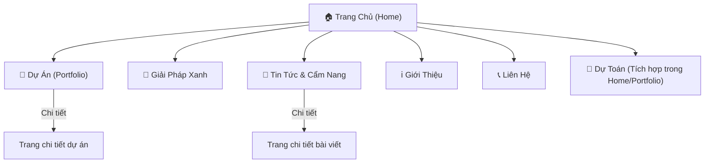

# 📋 TỔNG QUAN DỰ ÁN: XANH - DESIGN & BUILD WEBSITE

> **Tài liệu tổng hợp** từ toàn bộ nội dung trong thư mục `docs/` — phục vụ cho việc triển khai xây dựng website.

---

## 1. GIỚI THIỆU THƯƠNG HIỆU

| Thông tin | Chi tiết |
|---|---|
| **Tên thương hiệu** | XANH - Design & Build |
| **Pháp nhân** | Công ty Cổ phần Đầu tư Thiết bị và Giải pháp Xanh |
| **Lĩnh vực** | Thiết kế & Thi công nội thất, xây dựng trọn gói theo định hướng bền vững |
| **Khu vực** | Khánh Hòa (trụ sở chính), phục vụ các tỉnh lân cận |
| **Tầm nhìn** | Đơn vị dẫn đầu giải pháp "Chìa khóa trao tay" minh bạch & hiệu quả tại Khánh Hòa |
| **Thông điệp cốt lõi** | *"Đừng chỉ xây một ngôi nhà. Hãy xây dựng sự bình yên."* |

### Triết lý "4 Xanh" — DNA thương hiệu

| # | Tên | Ý nghĩa | Icon gợi ý |
|---|---|---|---|
| 1 | **Xanh Chi phí** | Minh bạch, cam kết 100% không phát sinh chi phí | 💰 Đồng xu nảy mầm |
| 2 | **Xanh Vật liệu** | Bền bỉ, an toàn sức khỏe, vòng đời dài | 🌿 Lá cây |
| 3 | **Xanh Vận hành** | Tiết kiệm năng lượng, tối ưu gió trời & ánh sáng | ☀️ Nắng/Gió |
| 4 | **Xanh Giá trị** | Đồng hành, bảo trì trọn đời, giảm thiểu rủi ro | 🤝 Cái bắt tay |

### 4 Giá trị cốt lõi (Core Values)
1. **Hiệu Quả Thực Tế** — Chỉ thiết kế những gì có thể thi công được
2. **Minh Bạch** — Rõ ràng trong chi phí, vật liệu và quy trình
3. **Bền Vững** — Chất lượng thi công, công năng sử dụng, tài chính
4. **Đồng Hành** — Cam kết suốt vòng đời công trình

---

## 2. HỆ THỐNG NHẬN DIỆN (BRAND IDENTITY)

### 2.1 Bảng màu (Color Palette)

| Token | Hex | Vai trò |
|---|---|---|
| **Primary Green** | `#14513D` | Nền, navigation, mảng khối lớn → vững chãi, tin cậy |
| **Accent Orange** | `#FF8A00` | Nút CTA, điểm nhấn quan trọng → năng động, hành động |
| **Light Gray** | `#F3F4F6` | Nền phụ → thoáng đãng, hiện đại |
| **White** | `#FFFFFF` | Text trên nền tối, nền section sáng |
| **Beige** | `#D8C7A3` | Nền câu chuyện, tự nhiên & mộc mạc |

### 2.2 Typography

| Vai trò | Font | Ghi chú |
|---|---|---|
| **Headline** | **Founders Grotesk** | Mạnh mẽ, cá tính, sang trọng. Có sẵn 10 weights (Light → Bold, kể cả Italic) dạng `.otf` |
| **Body text** | **Inter** | Dễ đọc, hỗ trợ tốt mọi thiết bị. Variable font `.ttf` (Regular + Italic) |

> [!TIP]
> Cả 2 font đã được cung cấp sẵn trong `docs/FONT/`. Cần tích hợp `@font-face` vào CSS.

### 2.3 Logo & Icon

| Loại | Số file | Đường dẫn |
|---|---|---|
| Logo Full Tagline | 3 variants (PNG) | `docs/LOGO_PNG/LOGO FULL TAGLINE/` |
| Logo No Tagline | 3 variants (PNG) | `docs/LOGO_PNG/LOGO NO TAGLINE/` |
| Icon | 3 variants (PNG) | `docs/LOGO_PNG/ICON/` |

### 2.4 Tone of Voice
- **Phong cách:** Chuyên nghiệp, Kỹ thuật nhưng Dễ hiểu, Gần gũi
- **Từ khóa thường xuyên:** "Minh bạch", "Bền vững", "Đồng hành", "Tối ưu"
- **Tránh:** Lời hứa sáo rỗng, từ ngữ kiểu "bậc nhất", "đẳng cấp"
- **CTA chuẩn:** "Nhận Dự Toán" hoặc "Tư Vấn Kỹ Thuật" (không dùng CTA generic "Liên hệ ngay")

---

## 3. CẤU TRÚC WEBSITE (SITEMAP) & CHI TIẾT TỪNG TRANG

### Sitemap tổng quan

---

### 3.1 TRANG CHỦ (HomePage) — 8 Sections

Bố cục **Storytelling Layout** — dẫn dắt từ cảm xúc → nỗi đau → giải pháp → bằng chứng → hành động.

| # | Section | Nội dung chính | UI đặc biệt |
|---|---|---|---|
| 1 | **Hero (The Hook)** | Headline: *"Đừng Chỉ Xây Một Ngôi Nhà. Hãy Xây Dựng Sự Bình Yên."* | Video/ảnh nền gia đình bình yên + timelapse thi công. CTA Cam |
| 2 | **Nỗi trăn trở (Empathy)** | Gọi tên "góc khuất" ngành xây dựng truyền thống | Text block cảm xúc |
| 3 | **Triết lý 4 Xanh (Core Values)** | 4 lời cam kết nhân văn với icon | Grid 4 cột, icon + text |
| 4 | **Proof of Concept** | Dự án thực tế kèm câu chuyện gia chủ | **Before/After Slider** (3D vs Thực tế) |
| 5 | **Công cụ Dự Toán** | Form ngắn gọn nhận báo giá | Form input → Lead capture |
| 6 | **Quy trình 6 bước** | 6 bước đồng hành từ tư vấn → bảo trì | Interactive steps (hover/scroll) |
| 7 | **Testimonials** | Trích dẫn chủ nhà + ảnh thực tế | Carousel/Grid quotes |
| 8 | **CTA kết thúc** | *"Cùng Xanh, Viết Tiếp Câu Chuyện Của Riêng Bạn"* | 2 nút CTA (Tư vấn + Tải cẩm nang) |

---

### 3.2 TRANG GIỚI THIỆU (AboutPage) — 6 Sections

Kể chuyện thương hiệu theo cấu trúc: **Ấn tượng → Nỗi đau → Bước ngoặt → Triết lý → Cam kết → Tầm nhìn**.

| # | Section | Nội dung chính | UI đặc biệt |
|---|---|---|---|
| 1 | **Hero Banner** | *"Câu Chuyện Của Sự Liền Mạch & Bền Vững"* | Ảnh/video nội thất sang trọng. Overlay tối. Font Founders Grotesk |
| 2 | **The Pain** | 5 nỗi đau chủ đầu tư | 2 cột (Text + Hình). Nền Be `#D8C7A3` |
| 3 | **Turning Point** | Giải pháp khép kín "Thiết kế–Dự toán–Vật liệu–Thi công–Bảo hành" | **Sticky Scroll** hoặc Infographic vòng tròn khép kín. Nền trắng |
| 4 | **Philosophy "4 Xanh"** | 4 Card triết lý | Grid 4 cột, hover viền Cam `#FF8A00` |
| 5 | **Core Values** | 4 cam kết cốt lõi (Hiệu quả, Minh bạch, Bền vững, Đồng hành) | Nền Xanh đậm `#14513D` toàn màn hình. Chữ trắng/be |
| 6 | **Mission & Vision** | Tầm nhìn + Sứ mệnh + CTA | Text căn giữa. Nút CTA Cam |

---

### 3.3 TRANG DỰ ÁN (Portfolio) — 5 Sections

Trang **trọng tâm uy tín** — mỗi dự án là một Landing Page thu nhỏ.

| # | Section | Nội dung chính | UI đặc biệt |
|---|---|---|---|
| 1 | **Hero** | *"Tác Phẩm Thực Tế. Giá Trị Khởi Nguồn Từ Sự Thật."* | Minimalist, nền sáng |
| 2 | **Filter Bar** | Tabs: Tất cả / Đã bàn giao / Đang thi công / Concept. Lọc: Biệt thự / Nhà phố / Căn hộ / Nghỉ dưỡng | **Sticky tabs** + AJAX/Isotope filtering |
| 3 | **Project Grid** | Cards dự án: ảnh thực tế, tên, tagline (*"98% sát 3D \| 0% Phát sinh"*) | **Masonry Grid** hoặc 3 cột. Hover zoom 1.05x + overlay |
| 4 | **Trang chi tiết dự án** | Stats Bar + Câu chuyện (Bài toán & Lời giải) + Before/After Slider + Material Board + Gallery + Testimonial | **Before/After Image Slider**, Lightbox, Carousel vật liệu |
| 5 | **CTA cuối** | 2 nút: "Sử Dụng Công Cụ Dự Toán" + "Chat với Kỹ sư trưởng" | Link đến trang Dự toán + Zalo OA |

> [!IMPORTANT]
> **Trang chi tiết dự án** là trang quan trọng nhất. Cần hiển thị đầy đủ: thông số minh bạch (vị trí, diện tích, thời gian thi công, ngân sách), câu chuyện dự án, slider so sánh, thư viện vật liệu, gallery ảnh thực tế, và lời chứng thực.

---

### 3.4 TRANG GIẢI PHÁP XANH — 6 Sections

Trang chuyên sâu **giáo dục khách hàng** về triết lý "Xanh là giải pháp".

| # | Section | Nội dung chính | UI đặc biệt |
|---|---|---|---|
| 1 | **Hero** | *"Xanh Không Chỉ Là Một Khẩu Hiệu. Xanh Là Giải Pháp."* | Video/ảnh nội thất. Fade-in chậm |
| 2 | **The Pain** | "Mọi Bất Ổn Đều Bắt Nguồn Từ Sự Đứt Gãy" — 4 nỗi đau | **Timeline/Zig-zag layout**. Tông màu trầm |
| 3 | **Turning Point** | Chuỗi giá trị khép kín | Infographic vòng tròn. **Scroll-triggered draw animation** |
| 4 | **Triết lý 4 Xanh** | Chi tiết 4 khía cạnh | Grid 4 cột / Accordion. 4 icon nét thanh |
| 5 | **Brand DNA** | 4 cam kết (Hiệu quả, Minh bạch, Bền vững, Đồng hành) | **Sticky Scroll** (trái giữ tiêu đề, phải cuộn nội dung) |
| 6 | **CTA** | *"Cùng Xanh Xây Dựng Những Công Trình Đáng Để Đầu Tư"* | Nền tối. Nút CTA Cam/Xanh |

---

### 3.5 TRANG TIN TỨC & CẨM NANG (Blog) — 6 Sections

Kênh **SEO + giáo dục + thu thập Lead**.

| # | Section | Nội dung chính | UI đặc biệt |
|---|---|---|---|
| 1 | **Hero** | *"Cẩm Nang Xây Dựng & Không Gian Sống Bền Vững"* | **Search Bar lớn** giữa màn hình |
| 2 | **Categories** | 4 tabs: Kinh Nghiệm Xây Nhà / Vật Liệu Xanh / Xu Hướng / Nhật Ký Xanh | **Sticky Tabs (Pill Buttons)** + AJAX filter |
| 3 | **Featured Articles** | Layout "1 lớn + 2 nhỏ" | Card: Thumbnail + Tag + Tiêu đề + Thời gian đọc |
| 4 | **Article Grid** | Tất cả bài viết mới nhất | Masonry/Grid 3 cột. Hover zoom + đổi màu tiêu đề. **Load More (AJAX)** |
| 5 | **In-article CTA** | Sidebar form tư vấn + Banner giữa bài + Mục lục tự động | **Sticky Sidebar** (PC), **Inline Banner**, **ToC** |
| 6 | **Lead Magnet** | Ebook "Bí Quyết Xây Nhà Không Phát Sinh" | Form Zalo + Mockup sách 3D. Nền `#14513D` |

> [!TIP]
> **Tone bài viết:** Luôn có case study/con số cụ thể, đứng về phía khách hàng, chèn internal link về Dự Toán/Portfolio.

---

### 3.6 TRANG LIÊN HỆ (ContactPage) — 3 Sections

| # | Section | Nội dung chính | UI đặc biệt |
|---|---|---|---|
| 1 | **Hero** | *"Mọi Công Trình Bền Vững Đều Bắt Đầu Từ Một Cuộc Trò Chuyện"* | Banner 40-50vh để người dùng thấy ngay form bên dưới |
| 2 | **Contact Block** | 2 cột: Thông tin (Địa chỉ + Pháp nhân + Google Maps) / Form tư vấn | Form: 4 trường (Tên, SĐT, Dropdown loại hình, Textarea). CTA: *"Yêu Cầu Tư Vấn (Mức Phí 0 Đồng)"*. Validation + Thank-you page |
| 3 | **FAQ (Accordion)** | 4 câu hỏi thường gặp | Accordion đóng/mở |

---

## 4. TÍNH NĂNG KỸ THUẬT ĐẶC BIỆT

### 4.1 Tính năng phải có (Phase 1)

| Tính năng | Mô tả | Mức độ |
|---|---|---|
| **Công cụ Dự Toán Thông Minh** | Form nhập (loại hình, diện tích, gói vật liệu, liên hệ) → Báo giá sơ bộ (PDF/on-screen) + đẩy Lead | ⭐ Chủ chốt |
| **Before/After Image Slider** | So sánh bản vẽ 3D vs thực tế | ⭐ Chủ chốt |
| **Chatbox & Zalo Automation** | Kết nối tư vấn kỹ thuật | Quan trọng |
| **Form Lead Capture** | Trang Liên hệ + các CTA rải khắp website | Quan trọng |
| **Blog/CMS** | Đăng bài, phân loại, search, phân trang AJAX | Quan trọng |

### 4.2 Tính năng nâng cao (Phase 2+)

| Tính năng | Mô tả |
|---|---|
| **Cổng Theo Dõi Tiến Độ (Client Portal)** | Khách hàng đăng nhập xem nhật ký thi công, ảnh thực tế, biên bản nghiệm thu |
| **Tham quan 360°/VR** | "Đi dạo" trong dự án hoàn thiện hoặc concept 3D trên trình duyệt |

---

## 5. YÊU CẦU KỸ THUẬT & UX

### 5.1 Thiết kế UX/UI

| Yêu cầu | Chi tiết |
|---|---|
| **Triết lý** | "Thực" hơn "Đẹp" — Không dùng ảnh stock, sử dụng hình ảnh thực tế |
| **Layout** | Storytelling — dẫn dắt: Nỗi đau → Giải pháp |
| **Mobile First** | Bắt buộc. Đa số khách hàng tìm kiếm trên điện thoại |
| **Animations** | Reveal on Scroll nhẹ nhàng, tinh tế. Tránh hiệu ứng rối mắt |

### 5.2 UI Components đặc biệt cần xây dựng

**Từ tài liệu gốc:**

1. **Before/After Image Slider** — Thư viện: `img-comparison-slider` hoặc tương đương
2. **Interactive Process Steps** — Quy trình 6 bước hover/scroll
3. **Trust Indicators** — Khối số liệu (0% phát sinh, 24/7 bảo hành)
4. **Sticky Navigation/Filter** — Dùng cho Portfolio và Blog
5. **Accordion FAQ** — Trang Liên hệ
6. **Lightbox Gallery** — Portfolio chi tiết
7. **Carousel / Material Board** — Vật liệu dự án
8. **Scroll-triggered animations** — Infographic vòng tròn, draw-line
9. **Sticky Sidebar** — Blog article detail (PC)

**Gợi ý bổ sung** *(tham khảo từ top themes ThemeForest cùng ngành: Archi, Hiroshi, TheBuilt, Kalium, Architecturer):*

10. **Animated Counter / Stats Section** — Số liệu chạy animation khi cuộn đến (VD: "150+ công trình", "10 năm kinh nghiệm", "100% không phát sinh", "24/7 bảo hành"). Rất phổ biến trên Archi, TheBuilt → tạo ấn tượng mạnh về uy tín.

11. **Team Member Cards** — Grid giới thiệu đội ngũ KTS/Kỹ sư (ảnh, tên, chức danh, social links). Hover hiện bio ngắn. Nên đặt ở trang Giới Thiệu → tăng tính nhân văn, gần gũi.

12. **Services Grid / Icon Box** — Grid dịch vụ với icon SVG (Thiết kế, Thi công, Giám sát, Nội thất, Bảo trì…). Mỗi box link đến trang chi tiết hoặc anchor. Rất chuẩn mực trên mọi theme xây dựng hàng đầu.

13. **Partner / Certification Logos Bar** — Thanh logo đối tác vật liệu, chứng nhận ISO, thương hiệu hợp tác (Sơn Dulux, gỗ An Cường, thiết bị Schneider…). Carousel tự chạy → tăng trust.

14. **Parallax Section** — Section ảnh nền cố định (parallax) xen kẽ giữa các khối nội dung, tạo chiều sâu thị giác. Rất hiệu quả cho ảnh công trình panorama. Phổ biến trên Hiroshi, Kalium.

15. **Floating CTA Bar (Mobile)** — Thanh CTA cố định ở bottom màn hình mobile ("Gọi ngay" + "Nhận Dự Toán"). Tăng tỷ lệ chuyển đổi trên di động đáng kể — feature chuẩn của mọi theme construction.

16. **Project Timeline / Milestone** — Trục timeline dọc/ngang hiển thị các mốc phát triển công ty hoặc tiến trình thi công dự án. Scroll-triggered animation vẽ từng mốc. Tham khảo: TheBuilt, Architecturer.

17. **Video Popup / Modal** — Nút play video nhúng (YouTube/Vimeo) mở trong modal overlay thay vì nhúng trực tiếp. Giữ trang nhẹ + trải nghiệm cinematic. Dùng cho video giới thiệu công ty, timelapse thi công.

18. **Back to Top Button** — Nút cuộn về đầu trang, xuất hiện khi cuộn xuống. Cần thiết vì các trang dài (Home 8 sections, About 6 sections).

19. **Cookie Consent Banner** — Banner thông báo cookie/GDPR — bắt buộc nếu dùng Google Analytics + Facebook Pixel.

20. **Preloader / Page Transition** — Hiệu ứng loading khi chuyển trang, hiển thị logo Xanh → nhất quán thương hiệu. Mọi theme premium đều có.

21. **Breadcrumb Navigation** — Thanh breadcrumb cho trang Portfolio chi tiết và Blog chi tiết. Tốt cho UX lẫn SEO (Schema BreadcrumbList).

### 5.3 Hiệu năng & SEO

| Hạng mục | Yêu cầu |
|---|---|
| **PageSpeed** | > 90 điểm |
| **Ảnh** | Format WebP cho toàn bộ ảnh công trình |
| **SSL** | Cài đặt (bảo mật xanh) |
| **Schema** | Schema công trình xây dựng, từ khóa địa phương (Nha Trang, Khánh Hòa) |
| **Tracking** | Google Analytics + Facebook Pixel |
| **CTA Tracking** | Tag đo lường cho tất cả nút "Nhận dự toán" & "Tư vấn kỹ thuật" |
| **Thank-you page** | Sau khi khách để lại thông tin → đo lường chuyển đổi |
| **Google Maps** | Tích hợp iframe nhúng vị trí văn phòng |

---

## 6. TÀI NGUYÊN CÓ SẴN

| Loại | Vị trí | Ghi chú |
|---|---|---|
| Font Founders Grotesk | `docs/FONT/FoundersGrotesk/` | 10 file OTF (Light → Bold, kể cả Italic) |
| Font Inter | `docs/FONT/INTER/` | 2 file TTF Variable Font |
| Logo Full Tagline | `docs/LOGO_PNG/LOGO FULL TAGLINE/` | 3 phiên bản PNG |
| Logo No Tagline | `docs/LOGO_PNG/LOGO NO TAGLINE/` | 3 phiên bản PNG |
| Icon | `docs/LOGO_PNG/ICON/` | 3 phiên bản PNG |
| Brand Guideline | `docs/brand_guideline/` | File PDF (12.8MB) |
| Câu chuyện cốt lõi | `docs/core/` | 2 file DOCX (Brand Story + Ý nghĩa tên) |

---

## 7. LỘ TRÌNH TRIỂN KHAI (ROADMAP)

| Sprint | Nội dung | Ưu tiên |
|---|---|---|
| **Sprint 1** | Wireframe & UI Mockup cho Home, Portfolio | 🔴 Cao |
| **Sprint 2** | Front-end (HTML/CSS/JS) bám sát UI, Before/After Slider, các hiệu ứng | 🔴 Cao |
| **Sprint 3** | Module Dự Toán Nhanh + Hệ thống quản lý Lead (Back-end) | 🟠 Trung bình |
| **Sprint 4** | Tối ưu SEO, tốc độ tải trang, kiểm thử mobile | 🟠 Trung bình |
| **Sprint 5** | Go-live + Tracking (GA, FB Pixel) | 🟢 Hoàn thiện |

---

## 8. CHECKLIST KỸ THUẬT

- [ ] Cài đặt SSL
- [ ] Tích hợp fonts (Founders Grotesk + Inter) via `@font-face`
- [ ] Setup color tokens (CSS Variables)
- [ ] Responsive/Mobile First layout
- [ ] Before/After Image Slider component
- [ ] Interactive Process Steps component
- [ ] AJAX filtering (Portfolio + Blog)
- [ ] Form validation + Lead capture
- [ ] Google Maps integration
- [ ] Tối ưu hình ảnh (WebP)
- [ ] Google PageSpeed > 90
- [ ] Schema markup (Local Business + Construction)
- [ ] Google Analytics + Facebook Pixel
- [ ] CTA tracking tags
- [ ] Thank-you pages
- [ ] Chatbox / Zalo integration

---

> [!NOTE]
> **Tài liệu gốc chi tiết** nằm trong `docs/core/` (2 file DOCX về câu chuyện thương hiệu & ý nghĩa tên) và `docs/brand_guideline/` (Brand Guideline PDF). Nên tham khảo thêm khi xây dựng copywriting và visual design.
